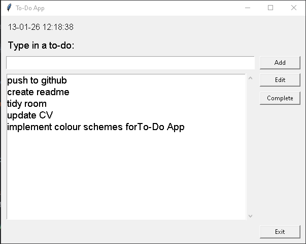

# ✅ To-Do GUI App (Python + Tkinter)

A clean and beginner-friendly **desktop To-Do List application** built in **Python** using **Tkinter** (built-in GUI library).  
Todos are saved to a local text file so they persist even after closing the app.

---

## ✨ Features

- ✅ Add new to-do items
- 🖱️ Click a to-do to load it into the input box
- ✏️ Edit any selected to-do
- ✅ Complete (remove) to-do items
- 🕒 Live clock display (updates automatically)
- 💾 Auto-saves to file (`todos.txt`)
- 📁 File is created automatically if missing

---

## 🧠 Why this project?

This project demonstrates core skills that apply to real software development:

- Building a GUI application
- Handling user input safely
- Reading and writing persistent data to a file
- Event-driven programming
- Clean structuring using functions + a class

It’s a simple app, but it teaches the fundamentals behind larger programs.

---

## 🛠️ Tech Used

- **Python 3**
- **Tkinter** (included with Python, no external installs needed)
- Local file storage via `todos.txt`

---

## 📸 Screenshot



---

## ▶️ How to Run

### 1) Clone the repository
```bash
git clone https://github.com/YOUR_USERNAME/YOUR_REPO_NAME.git
cd YOUR_REPO_NAME


